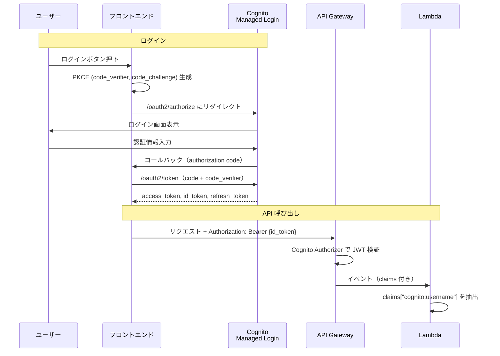

# 認証リファレンス

## 概要

本ドキュメントは、Cognito を用いた認証の実装リファレンスである。インフラ・フロントエンド・バックエンドにまたがる認証フロー全体を、ソースコードレベルで記述する。

### 前提

- 認証基盤（Cognito User Pool）はインフラユニットが CDK で管理する
- ログインの UI は **Cognito Managed Login** を使用し、フロントエンド側で認証画面を実装しない（セルフサインアップを有効にする場合はサインアップ UI も Cognito Managed Login を使用する）
- 認可フローは **Authorization Code Flow with PKCE** を採用する

---

## 全体フロー



---

## インフラ（Cognito User Pool）

インフラユニットが CDK で Cognito User Pool・App Client・カスタムドメインを作成し、CloudFormation エクスポートで他ユニットに公開する。

### User Pool

```python
# stacks/cognito_stack.py

user_pool = cognito.UserPool(
  self, "UserPool",
  user_pool_name=f"userpool-{project}-{env_name}-infra",
  self_sign_up_enabled=True,  # Requirements-dependent (True: self-signup / False: admin-only)
  sign_in_aliases=cognito.SignInAliases(email=True),
  auto_verify=cognito.AutoVerifiedAttrs(email=True),
  password_policy=cognito.PasswordPolicy(
    min_length=8,
    require_lowercase=True,
    require_uppercase=True,
    require_digits=True,
    require_symbols=True,
  ),
  account_recovery=cognito.AccountRecovery.EMAIL_ONLY,
  removal_policy=RemovalPolicy.RETAIN,
  sign_in_case_sensitive=False,
)
```

| 設定項目 | 値 | 備考 |
|---------|-----|------|
| セルフサインアップ | 要件次第 | `True`: ユーザー自己登録可 / `False`: 管理者がコンソールまたは CLI で作成 |
| サインイン方法 | メールアドレス | 大文字小文字区別なし |
| メール自動検証 | 有効 | |
| パスワードポリシー | 8文字以上、大小英数字+記号必須 | |
| アカウント復旧 | メールのみ | |
| 削除保護 | RETAIN | スタック削除時もデータ保持 |

### カスタムドメイン

Cognito Managed Login 用のカスタムドメインを設定し、Route 53 に A レコードを登録する。

```python
# stacks/cognito_stack.py

cognito_certificate = acm.Certificate.from_certificate_arn(
  self, "CognitoCertificate", cognito_certificate_arn,
)
user_pool_domain = user_pool.add_domain(
  "CognitoDomain",
  custom_domain=cognito.CustomDomainOptions(
    domain_name=cognito_auth_domain,
    certificate=cognito_certificate,
  ),
)

route53.ARecord(
  self, "CognitoAliasRecord",
  zone=hosted_zone,
  record_name=cognito_auth_domain,
  target=route53.RecordTarget.from_alias(
    targets.UserPoolDomainTarget(user_pool_domain),
  ),
)
```

> **注意**: Cognito カスタムドメインの証明書は **us-east-1** の ACM 証明書が必要。

### App Client

SPA 向けに、クライアントシークレットなし・Authorization Code Grant + PKCE で構成する。

```python
# stacks/cognito_stack.py

callback_url = f"https://{domain_name}/callback"
logout_url = f"https://{domain_name}/"

user_pool_client = user_pool.add_client(
  "UserPoolClient",
  user_pool_client_name=f"client-{project}-{env_name}-infra",
  generate_secret=False,
  auth_flows=cognito.AuthFlow(
    user_password=False,
    user_srp=False,
    admin_user_password=True,
  ),
  o_auth=cognito.OAuthSettings(
    flows=cognito.OAuthFlows(
      authorization_code_grant=True,
    ),
    scopes=[
      cognito.OAuthScope.OPENID,
      cognito.OAuthScope.EMAIL,
      cognito.OAuthScope.PROFILE,
      cognito.OAuthScope.COGNITO_ADMIN,
    ],
    callback_urls=[callback_url],
    logout_urls=[logout_url],
  ),
  supported_identity_providers=[
    cognito.UserPoolClientIdentityProvider.COGNITO,
  ],
  access_token_validity=Duration.hours(1),
  id_token_validity=Duration.hours(1),
  refresh_token_validity=Duration.days(30),
  enable_token_revocation=True,
  prevent_user_existence_errors=True,
)
```

| 設定項目 | 値 | 備考 |
|---------|-----|------|
| クライアントシークレット | なし | SPA のため |
| 認証フロー | Authorization Code Grant | PKCE 対応 |
| Admin 認証フロー | 有効 | バックエンドからの `AdminInitiateAuth` 用 |
| OAuth スコープ | openid, email, profile, aws.cognito.signin.user.admin | |
| コールバック URL | `https://{domain_name}/callback` | |
| ログアウト URL | `https://{domain_name}/` | |
| Access / ID トークン有効期限 | 1 時間 | |
| Refresh トークン有効期限 | 30 日 | |
| トークン失効 | 有効 | |

### CloudFormation エクスポート

他ユニットが参照するために、以下の値を `CfnOutput` でエクスポートする。

| 値 | 用途 |
|----|------|
| User Pool ARN | バックエンド（API Gateway Authorizer, IAM ポリシー） |
| User Pool ID | バックエンド（Lambda 環境変数） |
| Client ID | バックエンド（Lambda 環境変数）、フロントエンド（ビルド時） |
| Cognito ドメイン | フロントエンド（ビルド時） |

エクスポート名の命名規則やユニット間の受け渡し仕様は、各プロジェクトのユニット間契約ドキュメントに従うこと。

---

## フロントエンド

### 環境変数

| 変数名 | 用途 |
|--------|------|
| VITE_COGNITO_DOMAIN | Cognito ドメイン |
| VITE_COGNITO_CLIENT_ID | Cognito アプリクライアント ID |
| VITE_COGNITO_REGION | Cognito リージョン |
| VITE_REDIRECT_URI | 認可コールバック URI |

### ログイン

Cognito Managed Login の `/oauth2/authorize` エンドポイントにリダイレクトする。PKCE の `code_challenge` を付与する。

```typescript
// auth.ts

const COGNITO_DOMAIN = import.meta.env.VITE_COGNITO_DOMAIN
const CLIENT_ID = import.meta.env.VITE_COGNITO_CLIENT_ID
const REDIRECT_URI = import.meta.env.VITE_REDIRECT_URI
const SCOPES = 'openid email profile aws.cognito.signin.user.admin'

async function login() {
  const { verifier, challenge } = await generatePkce()
  sessionStorage.setItem(PKCE_VERIFIER_KEY, verifier)

  const params = new URLSearchParams({
    response_type: 'code',
    client_id: CLIENT_ID,
    redirect_uri: REDIRECT_URI,
    scope: SCOPES,
    code_challenge_method: 'S256',
    code_challenge: challenge,
  })
  window.location.href = `https://${COGNITO_DOMAIN}/oauth2/authorize?${params}`
}
```

### サインアップ（セルフサインアップ有効時のみ）

> セルフサインアップを無効にしている場合、このセクションは不要。

ログインと同じフローだが、`/signup` エンドポイントを使用する。

```typescript
// auth.ts

async function signup() {
  const { verifier, challenge } = await generatePkce()
  sessionStorage.setItem(PKCE_VERIFIER_KEY, verifier)

  const params = new URLSearchParams({
    response_type: 'code',
    client_id: CLIENT_ID,
    redirect_uri: REDIRECT_URI,
    scope: SCOPES,
    code_challenge_method: 'S256',
    code_challenge: challenge,
  })
  window.location.href = `https://${COGNITO_DOMAIN}/signup?${params}`
}
```

### コールバック（トークン交換）

Cognito からリダイレクトで受け取った authorization code を、PKCE の `code_verifier` と共にトークンに交換する。

```typescript
// auth.ts

async function exchangeCodeForTokens(code: string): Promise<boolean> {
  const codeVerifier = sessionStorage.getItem(PKCE_VERIFIER_KEY)
  if (!codeVerifier) return false

  const res = await fetch(`https://${COGNITO_DOMAIN}/oauth2/token`, {
    method: 'POST',
    headers: { 'Content-Type': 'application/x-www-form-urlencoded' },
    body: new URLSearchParams({
      grant_type: 'authorization_code',
      client_id: CLIENT_ID,
      redirect_uri: REDIRECT_URI,
      code,
      code_verifier: codeVerifier,
    }),
  })
  if (!res.ok) return false

  const tokens = await res.json()
  saveTokens(tokens)  // sessionStorage + リアクティブ状態に保存
  sessionStorage.removeItem(PKCE_VERIFIER_KEY)
  return true
}
```

コールバックページでは、URL パラメータから `code` を取得してトークン交換を行う。

```typescript
// CallbackPage.vue

onMounted(async () => {
  const params = new URLSearchParams(window.location.search)
  const code = params.get('code')
  if (!code) {
    error.value = true
    return
  }

  const success = await exchangeCodeForTokens(code)
  if (success) {
    router.replace('/')
  } else {
    error.value = true
  }
})
```

### トークン保存

トークンは **sessionStorage** に保存する。Vue の ref でリアクティブ状態も併せて管理する。

```typescript
// auth.ts

const ACCESS_TOKEN_KEY = 'cognito_access_token'
const ID_TOKEN_KEY = 'cognito_id_token'
const REFRESH_TOKEN_KEY = 'cognito_refresh_token'

const accessToken = ref<string | null>(sessionStorage.getItem(ACCESS_TOKEN_KEY))
const idToken = ref<string | null>(sessionStorage.getItem(ID_TOKEN_KEY))

function saveTokens(tokens: { access_token: string; id_token: string; refresh_token?: string }) {
  accessToken.value = tokens.access_token
  idToken.value = tokens.id_token
  sessionStorage.setItem(ACCESS_TOKEN_KEY, tokens.access_token)
  sessionStorage.setItem(ID_TOKEN_KEY, tokens.id_token)
  if (tokens.refresh_token) {
    sessionStorage.setItem(REFRESH_TOKEN_KEY, tokens.refresh_token)
  }
}
```

### API リクエストへのトークン添付

カスタム fetch ラッパーで、全リクエストに `Authorization: Bearer {id_token}` を付与する。

```typescript
// custom-fetch.ts

import { getIdToken, refreshTokens, forceLogout } from '@/auth/auth'

async function customFetch<T>(baseUrl: string, url: string, options: RequestInit): Promise<T> {
  const targetUrl = `${baseUrl}${url}`

  let res = await fetch(targetUrl, {
    ...options,
    headers: {
      Authorization: `Bearer ${getIdToken()}`,
      ...options.headers,
    },
  })

  // 401: リフレッシュトークンで再取得してリトライ
  if (res.status === 401) {
    const refreshed = await refreshTokens()
    if (refreshed) {
      res = await fetch(targetUrl, {
        ...options,
        headers: {
          Authorization: `Bearer ${getIdToken()}`,
          ...options.headers,
        },
      })
    }
    // リフレッシュ失敗 or リトライも 401 → 強制ログアウト
    if (res.status === 401) {
      forceLogout()
      return { data: undefined, status: 401, headers: res.headers } as T
    }
  }

  if (res.status === 204) {
    return { data: undefined, status: 204, headers: res.headers } as T
  }
  const data = await res.json()
  return { data, status: res.status, headers: res.headers } as T
}
```

> **ポイント**: API Gateway の Cognito Authorizer は **ID トークン**を検証する。Access トークンではない。

### トークンリフレッシュ

リフレッシュトークンを使って新しいトークンを取得する。同時に複数のリフレッシュリクエストが発生しないよう直列化する。

```typescript
// auth.ts

let refreshPromise: Promise<boolean> | null = null

async function refreshTokens(): Promise<boolean> {
  if (refreshPromise) return refreshPromise
  refreshPromise = doRefresh()
  try {
    return await refreshPromise
  } finally {
    refreshPromise = null
  }
}

async function doRefresh(): Promise<boolean> {
  const refreshToken = sessionStorage.getItem(REFRESH_TOKEN_KEY)
  if (!refreshToken) return false

  const res = await fetch(`https://${COGNITO_DOMAIN}/oauth2/token`, {
    method: 'POST',
    headers: { 'Content-Type': 'application/x-www-form-urlencoded' },
    body: new URLSearchParams({
      grant_type: 'refresh_token',
      client_id: CLIENT_ID,
      refresh_token: refreshToken,
    }),
  })
  if (!res.ok) return false

  const tokens = await res.json()
  saveTokens(tokens)
  return true
}
```

### ログアウト

ローカルのトークンを削除し、Cognito の `/logout` エンドポイントにリダイレクトする。

```typescript
// auth.ts

function logout() {
  clearTokens()
  const logoutUri = REDIRECT_URI.replace('/callback', '/')
  const params = new URLSearchParams({
    client_id: CLIENT_ID,
    logout_uri: logoutUri,
  })
  window.location.href = `https://${COGNITO_DOMAIN}/logout?${params}`
}
```

### ルートガード

認証が必要なルートには `meta: { requiresAuth: true }` を設定し、`beforeEach` ガードで認証状態を検査する。

```typescript
// router/index.ts

router.beforeEach((to) => {
  if (to.meta.requiresAuth) {
    const { isAuthenticated } = useAuth()
    if (!isAuthenticated.value) {
      return { name: 'home' }
    }
  }
})
```

### パスワード変更

パスワード変更はバックエンドを経由せず、フロントエンドから **Cognito SDK** (`ChangePassword` API) を直接呼び出す。Access トークンで認証する。

```typescript
// ChangePasswordPage.vue

import {
  CognitoIdentityProviderClient,
  ChangePasswordCommand,
} from '@aws-sdk/client-cognito-identity-provider'
import { getAccessToken } from '@/auth/auth'

async function handleSubmit() {
  const client = new CognitoIdentityProviderClient({
    region: import.meta.env.VITE_COGNITO_REGION,
  })
  await client.send(
    new ChangePasswordCommand({
      AccessToken: getAccessToken(),
      PreviousPassword: currentPassword.value,
      ProposedPassword: newPassword.value,
    }),
  )
}
```

---

## バックエンド

### API Gateway Cognito Authorizer

SAM テンプレートで API Gateway にデフォルト Authorizer を設定する。全エンドポイントに Cognito 認証が適用される。

```yaml
# template.yaml

ApiGateway:
  Type: AWS::Serverless::Api
  Properties:
    StageName: Prod
    Auth:
      DefaultAuthorizer: CognitoAuthorizer
      Authorizers:
        CognitoAuthorizer:
          UserPoolArn: !ImportValue <CognitoUserPoolArn のエクスポート名>
          Identity:
            Header: Authorization
```

認証不要なエンドポイントは、個別に `Auth: Authorizer: NONE` を指定する。

```yaml
# template.yaml

PublicEndpoint:
  Type: Api
  Properties:
    Path: /api/v1/xxx/public/{id}
    Method: GET
    Auth:
      Authorizer: NONE
```

### ユーザー識別

API Gateway が JWT を検証し、Lambda には claims が渡される。`cognito:username` からユーザーを識別する。

```python
# common/auth.py

from aws_lambda_powertools.event_handler import APIGatewayRestResolver

def get_username(app: APIGatewayRestResolver) -> str:
  return app.current_event.request_context.authorizer.claims["cognito:username"]
```

ルートハンドラでは、最初に `get_username()` を呼び出してサービス層に渡す。

```python
# routes/items.py

from common.auth import get_username

@router.get("/")
def get_items():
  username = get_username(router)
  return item_service.get_items(username)

@router.post("/")
def create_item():
  username = get_username(router)
  body = router.current_event.json_body or {}
  item = item_service.create_item(username, body)
  return Response(status_code=201, content_type="application/json", body=json.dumps(item))
```

### Cognito 管理操作（boto3）

Lambda から Cognito の管理 API を呼び出す場合は boto3 を使用する。IAM ポリシーで必要な操作のみ許可する。

#### ユーザー情報取得

JWT クレームからユーザー属性を取得し、Cognito API で補完する。

```python
# services/user_service.py

def get_me(claims: dict) -> dict:
  username = claims["cognito:username"]
  email = claims.get("email", "")
  email_verified = claims.get("email_verified", "false")

  client = boto3.client("cognito-idp")
  try:
    user_info = client.admin_get_user(
      UserPoolId=USER_POOL_ID,
      Username=username,
    )
    created_at = user_info["UserCreateDate"].strftime("%Y-%m-%dT%H:%M:%SZ")
  except ClientError:
    created_at = ""

  return {
    "username": username,
    "email": email,
    "email_verified": email_verified in ("true", True),
    "created_at": created_at,
  }
```

#### アカウント削除（パスワード再検証）

アカウント削除のような破壊的操作では、`AdminInitiateAuth` でパスワードを再検証してからデータ削除と Cognito ユーザー削除を行う。

```python
# services/user_service.py

def delete_account(username: str, password: str) -> None:
  if not password:
    raise ValidationError("password is required")

  client = boto3.client("cognito-idp")

  # Verify password via AdminInitiateAuth
  try:
    client.admin_initiate_auth(
      UserPoolId=USER_POOL_ID,
      ClientId=CLIENT_ID,
      AuthFlow="ADMIN_NO_SRP_AUTH",
      AuthParameters={
        "USERNAME": username,
        "PASSWORD": password,
      },
    )
  except ClientError as e:
    if e.response["Error"]["Code"] in (
      "NotAuthorizedException",
      "UserNotFoundException",
    ):
      raise AuthenticationError("Invalid password")
    raise

  # Delete application data for the user
  # (implementation depends on the project)

  # Delete Cognito user
  client.admin_delete_user(
    UserPoolId=USER_POOL_ID,
    Username=username,
  )
```

フロントエンドではバックエンド API を呼び出し、成功後にローカルのログアウト処理を行う。

```typescript
// DeleteAccountPage.vue

import { useAuth } from '@/auth/auth'

const { logout } = useAuth()

async function handleDelete() {
  const res = await deleteAccount({ password: password.value })
  if (res.status !== 204) {
    // Handle error
    return
  }
  logout()
  router.push('/')
}
```

### IAM ポリシー

Lambda から Cognito 管理操作を行うために、必要最小限の権限を付与する。

```yaml
# template.yaml

Policies:
  - Version: "2012-10-17"
    Statement:
      - Effect: Allow
        Action:
          - cognito-idp:AdminInitiateAuth
          - cognito-idp:AdminDeleteUser
          - cognito-idp:AdminGetUser
        Resource: !ImportValue <CognitoUserPoolArn のエクスポート名>
```
