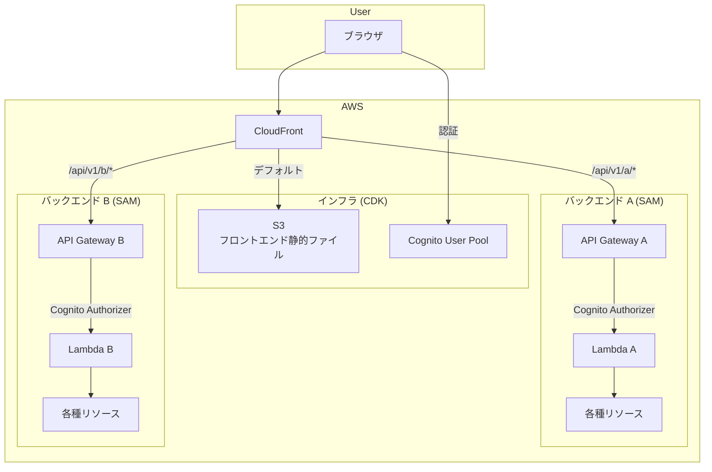

# 技術方針

## 概要

本ドキュメントは、システム全体の技術方針（レイヤー構成・技術選定）を定める。

## 全体構成図

---

## レイヤー構成の方針

### フロントエンド

- SPA として構築し、ビルド成果物（静的ファイル）を S3 経由で配信する
- AWS リソースの管理は行わない

### バックエンド

- マイクロサービスアーキテクチャを採用し、以下の原則に従う
  - **各マイクロサービスはリソースを共有しない**: データストア等のリソースは各サービス内で定義・管理する
  - **各マイクロサービスは独立してデプロイ可能**: 他のマイクロサービスに影響を与えずにデプロイできる
  - **唯一の共有リソースは Cognito**: 全マイクロサービスが同一の Cognito User Pool を参照する。そのため Cognito は共通インフラとして管理し、各バックエンドに情報を渡す
- 各マイクロサービスは原則として Lambdalith 構成（単一 Lambda で全エンドポイントを処理）を採用する。ただし、サービスの要件によっては 1 つのマイクロサービスが複数の Lambda 関数を持つ場合もある

### インフラ

- 全レイヤーに共通する基盤のみを管理する
  - 認証基盤（Cognito）。ログイン・サインアップの UI は Cognito Managed Login を利用し、フロントエンド側での認証画面の実装を省く。パスワード変更はフロントエンドから Cognito SDK（`ChangePassword` API）を直接呼び出す
  - フロントエンド配信（S3）
  - ルーティング（CloudFront によるパスベースの振り分け）
- 各バックエンドマイクロサービス固有のリソースは管理しない

### CI/CD

- 環境（インフラ・バックエンド等）とは独立して構築できること
- 各レイヤーのビルドとデプロイを自動化する

---

## 技術選定

| レイヤー | 技術 | 選定理由 |
|---------|------|---------|
| フロントエンド | Vue 3 SPA | コンポーネント指向で SPA に適している |
| バックエンド | Python, API Gateway + Lambda (SAM) | サーバーレスで運用負荷が低い。SAM により Lambda + API Gateway を一体管理できる |
| インフラ | CloudFront, S3, Cognito (CDK) | CDK により共通基盤をプログラマブルに管理できる |
| CI/CD | CodeBuild (CloudFormation) | 環境に依存せず独立して構築できる。CDK や SAM のインストールが不要 |
