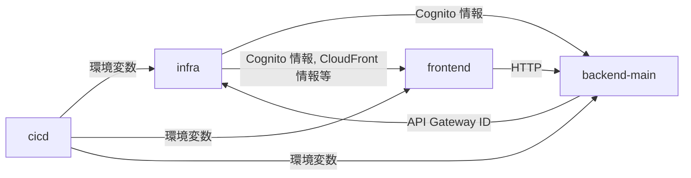
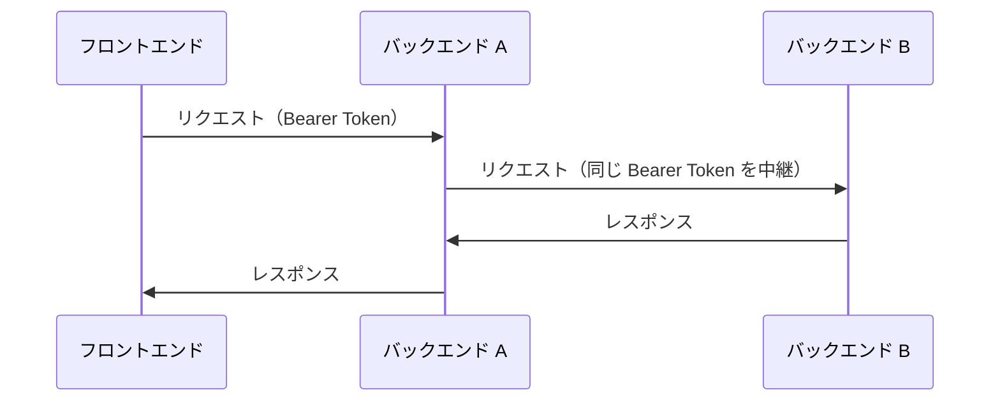

<!-- AI instruction (pinned): UC 番号は他文書から参照されるため、初回制定以後に変更が生じた場合、番号を詰めてはならない（欠番が生じてもそのままにする） -->

# ユニット間の契約

## 概要

本ドキュメントは、[units_definition.md](units_definition.md) で定義した各ユニット間の契約を定義する。

- **UC-1（管理規約）**: プロジェクト共通の命名規則・リポジトリ管理
- **UC-2（インターフェース定義）**: ユニット間で受け渡す値の定義
- **UC-3（連携仕様）**: ユニット間の通信など連携に関する仕様と方針

---

## UC-1: 管理規約

AWS リソースの命名やリポジトリ管理に使用する変数を以下の通り定義する。

| 変数 | 意味 | 値 |
|------|------|-----|
| `${project}` | プロジェクト識別子（固定） | `fdp` |
| `${env}` | 環境識別子（可変） | `dev`, `pro` |
| `${service}` | サービス識別名 | 下表参照 |

### ユニット別定義

| ユニット | `${service}` | GitHub リポジトリ | サブモジュールパス |
|---------|-------------|-----------------|-----------------|
| フロントエンド | `frontend` | `h-akira/FinanceDashboardProject2_Frontend` | `Frontend/` |
| メイン API | `backend-main` | `h-akira/FinanceDashboardProject2_Backend_main` | `Backend/main/` |
| インフラ | `infra` | `h-akira/FinanceDashboardProject2_Infra` | `Infra/` |
| CI/CD | `cicd` | `h-akira/FinanceDashboardProject2_CICD` | `CICD/` |

各リポジトリは本プロジェクトの Git サブモジュールとして管理する。

### 命名パターン

| 対象 | パターン | 例 |
|------|---------|-----|
| スタック名 | `stack-${project}-${env}-<識別名>` | `stack-fdp-dev-backend-main` |
| AWS リソース名 | `<リソースタイプ>-${project}-${env}-<識別名>` | `role-fdp-dev-backend-main-LambdaExec` |
| エクスポート名 | `${project}-${env}-<識別名>` | `fdp-dev-backend-main-ApiGatewayId` |
| パラメータストア | `/${project}/${env}/<識別名>` | `/fdp/dev/backend-main/TableName` |

---

## UC-2: インターフェース定義

ユニット間の値の受け渡しには以下の方法を使用できる。

| 方法 | 用途 |
|------|------|
| CloudFormation エクスポート | スタック間の直接参照（`Fn::ImportValue`）。本プロジェクトでは CDK ↔ SAM 間を含め、原則としてこの方式を採用する |
| パラメータストア (SSM) | エクスポートでは対応できない場合の代替手段 |

### 依存関係図

infra ↔ backend-main 間に循環依存が存在する。実装時にはインフラユニット内でスタックを分割するなどして循環を解消すること。

### UC-2.1: インフラ → バックエンド（Cognito 情報）

インフラユニットが Cognito の情報を公開し、バックエンドユニットが参照する。

| キー | 値 | 用途 | 参照先 |
|------|-----|------|-------|
| `${project}-${env}-infra-CognitoUserPoolArn` | User Pool ARN | API Gateway の Cognito Authorizer | backend-main |
| `${project}-${env}-infra-CognitoUserPoolId` | User Pool ID | Lambda での認証検証（必要な場合） | backend-main |
| `${project}-${env}-infra-CognitoClientId` | App Client ID | Lambda での認証検証（必要な場合） | backend-main |

### UC-2.2: バックエンド → インフラ（API Gateway ID）

バックエンドユニットが API Gateway の情報を公開し、インフラユニットが CloudFront のオリジンとして登録する。

| キー | 値 | 用途 | 参照先 |
|------|-----|------|-------|
| `${project}-${env}-backend-main-ApiGatewayId` | REST API ID | CloudFront のオリジン設定 | infra |
| `${project}-${env}-backend-main-ApiGatewayStageName` | ステージ名 | CloudFront のオリジンパス | infra |

### UC-2.3: インフラ → フロントエンド（デプロイ先・ビルド時情報）

フロントエンドの `buildspec.yml` が CloudFormation エクスポートから値を取得し、デプロイ先の特定やビルド時の環境変数設定に使用する。

| キー | 値 | 用途 |
|------|-----|------|
| `${project}-${env}-infra-S3BucketName` | バケット名 | デプロイ先 S3 バケット |
| `${project}-${env}-infra-CloudFrontDistributionId` | Distribution ID | キャッシュ無効化の対象 |
| `${project}-${env}-infra-DomainName` | カスタムドメイン名 | `VITE_REDIRECT_URI` の生成 |
| `${project}-${env}-infra-CognitoClientId` | App Client ID | `VITE_COGNITO_CLIENT_ID` |
| `${project}-${env}-infra-CognitoDomain` | Cognito ドメイン | `VITE_COGNITO_DOMAIN` |

### UC-2.4: CI/CD → 各サービス（CodeBuild 環境変数）

CI/CD ユニットが CodeBuild プロジェクトの `EnvironmentVariables` として注入し、各サービスの `buildspec.yml` が参照する。

#### 共通

| 環境変数 | 値の出所 | 用途 |
|---------|---------|------|
| `ENV` | CI/CD パラメータ（`dev`, `pro`） | スタック名・パラメータの環境切り替え |

#### フロントエンド固有

| 環境変数 | 値の出所 | 用途 |
|---------|---------|------|
| `PROJECT` | 固定値（`fdp`） | CloudFormation エクスポート名のプレフィックス |

---

## UC-3: 連携仕様

### UC-3.1: フロントエンド ↔ バックエンド通信仕様

フロントエンドとバックエンドは CloudFront を介して同一ドメインで配信される。CloudFront でのパスパターン割り当ては以下の通り。

| サービス | パスパターン |
|---------|------------|
| `backend-main` | `/api/v1/main/*` |

| 項目 | 仕様 |
|------|------|
| 認証方式 | `Authorization: Bearer {ID Token}` ヘッダー |
| データ形式 | JSON (`Content-Type: application/json`) |
| エラー形式 | `{ "message": "エラーメッセージ" }` |
| CORS | CloudFront 経由の同一オリジンのためブラウザ上は不要。API Gateway 側の CORS は直接アクセス対策として設定 |

各バックエンドの API エンドポイント定義は以下を参照。

- メイン API: [openapi_main.yaml](openapi_main.yaml)

### UC-3.2: バックエンド間連携の方針（将来）

現時点ではバックエンドは1つのため、バックエンド間連携は存在しない。将来的にバックエンドが分割された場合に備え、以下の方針を定める。

#### 連携方式

| 方式 | 用途 | 手段 |
|------|------|------|
| 同期連携 | あるバックエンドが別のバックエンドの API を呼び出す | Lambda から API Gateway のエンドポイントを HTTP で呼び出す |
| 非同期連携 | イベント駆動で別のバックエンドに処理を委譲する | SNS/SQS を介したメッセージング |

#### 認証情報の扱い

バックエンド間連携時の認証は以下のいずれかの方式を採用する。

##### 方式 A: ユーザーのトークンを中継する

- フロントエンドから受け取った ID Token をそのまま中継先バックエンドに渡す
- 呼び出し先の API Gateway の Cognito Authorizer がトークンを検証する
- ユーザーコンテキストが保持されるため、呼び出し先でも `cognito:username` を取得可能
- 追加の認証設定が不要

##### 方式 B: IAM 認証を使用する

- Lambda の実行ロールに呼び出し先 API Gateway の `execute-api:Invoke` 権限を付与する
- IAM 認証（SigV4 署名）で API Gateway を呼び出す
- ユーザーコンテキストはリクエストボディやヘッダーで明示的に渡す必要がある
- サービス間通信であることが明確になる

#### 採用方針

- **同期連携**: ユーザー操作の文脈で別サービスのデータが必要な場合は**方式 A（トークン中継）**を優先する。シンプルで追加の認証設定が不要なためである
- **非同期連携**: SNS/SQS を介する場合はトークンを中継できないため、**方式 B（IAM 認証）**または認証不要な内部エンドポイントを使用する
